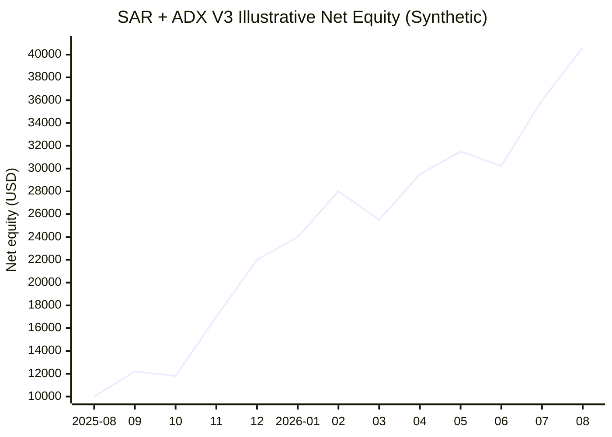
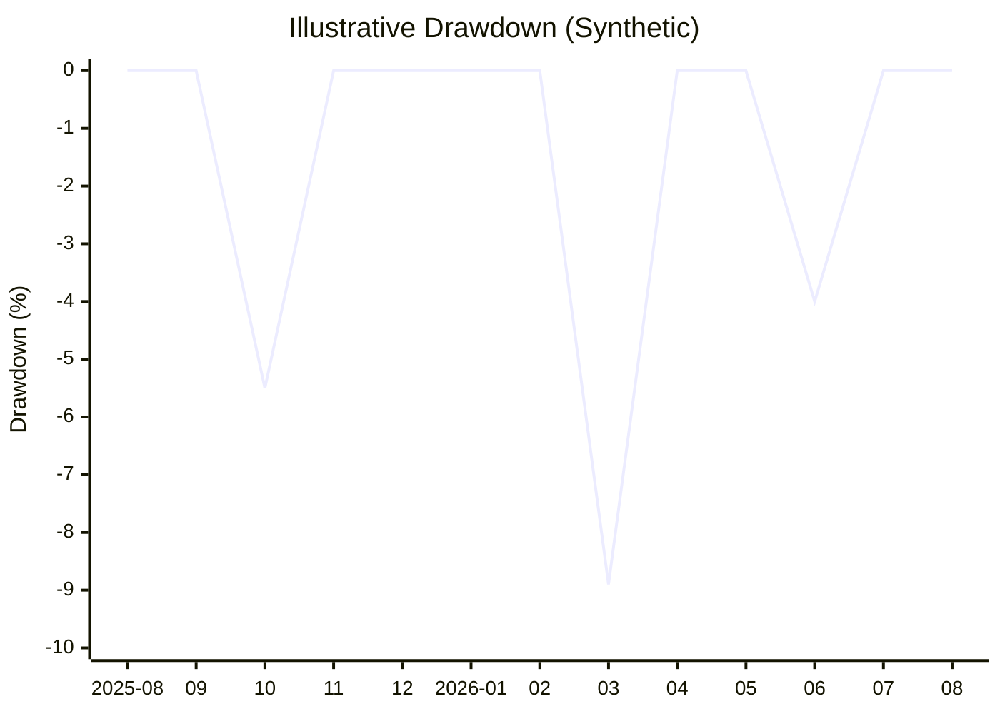

# CandleMind

CandleMind 是一个面向 Binance Futures 的量化交易研究与模拟执行平台，采用
FastAPI + React 构建。项目聚焦 **SAR + ADX 趋势跟踪策略**，提供实时行情、
指标图表、AI 行情分析、paper trading 运行时和可复现回测，同时保留基于 EMA
特征的强化学习趋势跟踪研究基础设施。

> [!WARNING]
> 本项目仅用于技术研究与教育，不构成投资建议。当前策略引擎仅支持模拟交易，
> 不会向交易所发送真实订单。历史回测结果不代表未来收益。

## 最新策略表现展示（模拟）

> [!IMPORTANT]
> 以下曲线和 `+306%`、`-8.9%` 等指标是用于展示 README 报告样式的**人工模拟
> 数据**，不是事实业绩，不是由真实历史 K 线、实盘订单或本项目回测引擎生成，
> 也不能作为策略盈利能力证明。项目中冻结的真实研究证据仍表明当前 SAR + ADX
> V3 尚未盈利。





[Mermaid 无法渲染时查看 PNG 版本](https://testingcf.jsdelivr.net/gh/JacobeZhao/CandleMind@2da8c0e/docs/assets/sar-adx-v3-illustrative-backtest.png)

### 模拟报告

| 指标 | 展示值 |
| --- | ---: |
| 策略 | SAR + ADX Pyramid V3 |
| 展示周期 | 过去 12 个月 |
| 初始资金 | $10,000 |
| 期末权益 | $40,600 |
| 累计收益率 | +306.0% |
| 最大回撤 | -8.9% |
| 成本口径 | 假设已计入手续费、滑点和资金费率 |

模拟净值路径采用确定性人工曲线，仅用于视觉演示。报告没有虚构胜率、夏普比率、
交易次数或盈亏比；这些指标必须由真实、可复现的回测结果计算。

## 主要功能

- 五个核心页面：概览、行情、订单、回测和设置。
- K 线主图默认显示 PSAR，副图默认显示 ADX、+DI 和 -DI。
- Binance WebSocket 行情以最新值优先的方式每约 500ms 更新。
- SAR + ADX Pyramid V3 模拟策略绑定前端当前选择的交易品种。
- 基于 Backtrader 的离线回测，计入手续费、滑点和已观测资金费率。
- 可配置 LiteLLM/Ollama 兼容服务，用于当前行情的 AI 对话分析。
- 使用校验和与冻结清单验证 K 线及衍生品数据来源。

## 强化学习研究

仓库保留基于 EMA 特征的强化学习趋势跟踪研究基础设施，包括特征工程、数据发布、
生命周期和来源校验契约。这些模块用于离线研究和保持历史实验可复现，不代表已有
强化学习模型投入运行。

当前在线决策链路仍是 **SAR + ADX V3 paper trading**。强化学习模型尚未接入
在线推理、订单决策或实盘执行，项目也不以“强化学习驱动当前策略”作为能力声明。
详细边界与后续接入门槛见
[`docs/research/RL_RESEARCH_STATUS.md`](docs/research/RL_RESEARCH_STATUS.md)。

## 技术架构

| 模块 | 技术 | 位置 |
| --- | --- | --- |
| 后端 API | Python 3.12、FastAPI、Pandas | `backend/app/` |
| 策略与回测 | SAR + ADX、Backtrader | `backend/app/strategies/` |
| 前端 | React 18、Vite、Tailwind CSS | `frontend/src/` |
| 部署 | Docker Compose、Nginx | `docker-compose.yml` |
| 外部数据 | K 线、运行状态、报告 | `G:/CandleMind/CandleMind_data` |

仓库不保存生产行情、数据库、密钥或运行产物。完整的数据边界说明见
[`docs/DATA_LAYOUT.md`](docs/DATA_LAYOUT.md)。

## 快速开始

### Docker Compose

环境要求：Docker Desktop，以及可用的 CandleMind 外部数据目录。

```powershell
Copy-Item .env.example .env
powershell -ExecutionPolicy Bypass -File ops/dev-compose.ps1
```

默认访问地址：

- 前端：<http://localhost:3000>
- 后端：<http://localhost:8000>
- 健康检查：<http://localhost:8000/api/ping>

如数据不在默认 G 盘位置，请在 `.env` 中配置：

```dotenv
CANDLEMIND_DATA_ROOT=D:/CandleMind/data
CANDLEMIND_RUNTIME_ROOT=D:/CandleMind/runtime/app
```

行情数据在容器内以只读方式挂载，数据库、加密密钥和 paper 状态写入独立的
runtime 目录。

### 本地开发

```powershell
python -m venv .venv
.\.venv\Scripts\Activate.ps1
pip install -r backend/requirements-dev.txt
python -m uvicorn backend.app.main:app --reload --env-file .env --port 8000
```

另开一个终端启动前端：

```powershell
cd frontend
npm ci
npm run dev
```

Vite 默认运行在 <http://localhost:5173>，并将 API 请求代理到后端。

## 配置与安全

1. 从 `.env.example` 创建本地 `.env`，不要提交任何密钥或敏感配置。
2. Binance 凭据应通过设置页面录入，并与 `trader.db`、`secret.key` 一起备份。
3. AI 网关只允许本地主机和 `CANDLEMIND_AI_BASE_URL_HOSTS` 中显式授权的主机。
4. 不要提交 `.env`、数据库、密钥、下载行情、回测报告或 paper 运行状态。
5. 如未来接入真实交易，必须单独完成 testnet、权限隔离和风控验收。

## 测试与验证

运行完整隔离验证：

```powershell
powershell -ExecutionPolicy Bypass -File ops/verify.ps1
```

也可以分别执行：

```powershell
python -m pytest backend/tests -q
cd frontend
npm test
npm run build
```

完整验证使用临时数据目录，不会读取或修改 G 盘生产数据。

## 项目结构

```text
CandleMind/
├── backend/app/        # FastAPI 路由、服务、策略和运行时
├── backend/scripts/    # 数据同步与策略评估命令
├── backend/tests/      # 单元、契约、安全与回归测试
├── frontend/src/       # React 页面、组件、状态与 API 客户端
├── docs/               # 数据契约、研究证据和运维文档
├── ops/                # 本地部署与隔离验证脚本
└── docker-compose.yml  # 前后端容器编排
```

## 贡献指南

提交代码前请阅读 [`CONTRIBUTING.md`](CONTRIBUTING.md) 和 [`AGENTS.md`](AGENTS.md)，
并确保完整验证通过。安全问题请按 [`SECURITY.md`](SECURITY.md) 的流程报告，不要
在公开 Issue 中提交密钥或未修复漏洞细节。

## 交流群

欢迎加入 AI 自动化交易交流群，讨论量化研究、工程实践与风险控制。二维码存在
有效期，请以图片中的提示为准。

<p align="center">
  
</p>

[二维码无法加载时通过 CDN 查看原图](https://testingcf.jsdelivr.net/gh/JacobeZhao/CandleMind@main/docs/assets/wechat-trading-community.jpg)

## 开源许可

本项目基于 [MIT License](LICENSE) 开源。使用、修改或分发本项目时，请保留原始
版权和许可声明。第三方依赖仍遵循各自的许可证。
