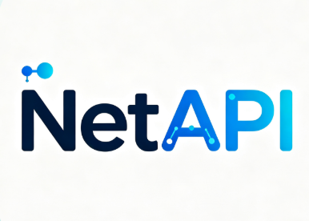

<div align="center">
  
  <h1>CandleMind</h1>
  <p><strong>Binance Futures 向けオープンソースのトレンド取引研究・自動執行プラットフォーム</strong></p>
  <p>
    <a href="README.md">简体中文</a> |
    <a href="README_EN.md">English</a> |
    <strong>日本語</strong> |
    <a href="README_KO.md">한국어</a>
  </p>
  <p>
    <a href="LICENSE"></a>
    
    
    
  </p>
</div>

> [!WARNING]
> CandleMind は技術研究および教育のみを目的としており、投資助言ではありません。自動売買戦略は Binance Futures のテストネットまたはメインネットへ注文を送信できます。初期設定はテストネットで、メインネットはサーバー側で無効です。過去の研究、例示値、バックテストは実績でも将来の利益保証でもありません。

## 概要

CandleMind は FastAPI と React で構築され、リアルタイム市場データ、トレンド分析、戦略設定、取引所での注文執行、口座統計を一つのワークスペースにまとめます。**CandleMind トレンド戦略**を中心に、市場画面では表示領域全体に追従するサイズ変更可能なローソク足チャートとリアルタイム AI 市場アシスタントを提供し、再現可能なオフライン研究基盤も維持します。

設定画面にはグローバル取引所セレクターがあります。現在実装済みなのは **Binance Futures** のみです。OKX、Bybit、Gate.io、A 株は将来接続するための未接続プレースホルダーであり、選択しても Binance の市場、口座、取引 API は呼び出されません。

## 主な機能

| 機能 | 説明 |
| --- | --- |
| リアルタイム市場 | Binance WebSocket、ローソク足、メインチャート指標、表示領域に追従するサイズ変更可能なワークスペース |
| AI 市場アシスタント | 確定済みの複数時間軸データを継続分析し、対話にも対応 |
| 戦略ランタイム | 選択した銘柄とネットワークに連動する三つの設定可能な自動戦略 |
| 注文・口座 | 未約定注文、約定、注文履歴、収益、勝率、プロフィットファクター |
| オフライン研究 | データ検証、戦略評価、強化学習研究契約 |
| 取引保護 | テストネット優先、メインネットの二重制御、数量検証、冪等な注文ログ |

公開アプリは概要、市場、注文、戦略、設定の五つの画面で構成されます。内部評価機能は研究用に維持されますが、公開バックテスト画面および `/api/backtest/*` API はありません。

設定画面を開いている間は、表示時に出口 IP を検出し、その後は 1 分ごとに自動更新します。次の検出が完了するまで前回の結果を保持します。グローバル取引所の選択は概要、市場、注文などの各画面に一貫して反映され、上部バーから銘柄の切り替えと現在画面の「更新」を実行できます。

## 技術構成

| レイヤー | 技術 | ディレクトリ |
| --- | --- | --- |
| バックエンド API | Python 3.12、FastAPI、Pandas | `backend/app/` |
| 戦略・評価 | 自動戦略ランタイム、Backtrader オフライン評価 | `backend/app/strategies/` |
| フロントエンド | React 18、Vite、Tailwind CSS | `frontend/src/` |
| デプロイ | Docker Compose、Nginx | `docker-compose.yml` |
| 外部データ | ローソク足、実行状態、研究レポート | `G:/CandleMind/CandleMind_data` |

本番市場データ、データベース、秘密情報、生成レポートは Git に保存しません。詳細は [`docs/DATA_LAYOUT.md`](docs/DATA_LAYOUT.md) を参照してください。

## クイックスタート

### Docker Compose

Docker Desktop を準備し、次を実行します。

```powershell
Copy-Item .env.example .env
powershell -ExecutionPolicy Bypass -File ops/dev-compose.ps1
```

起動後は Web <http://localhost:3000>、API <http://localhost:8000>、ヘルスチェック <http://localhost:8000/api/ping> にアクセスできます。

外部データの場所を変更する場合は `.env` を設定します。

```dotenv
CANDLEMIND_DATA_ROOT=D:/CandleMind/data
CANDLEMIND_RUNTIME_ROOT=D:/CandleMind/runtime/app
```

### ローカル開発

```powershell
python -m venv .venv
.\.venv\Scripts\Activate.ps1
pip install -r backend/requirements-dev.txt
python -m uvicorn backend.app.main:app --reload --env-file .env --port 8000
```

別のターミナルでフロントエンドを起動します。

```powershell
cd frontend
npm ci
npm run dev
```

Vite は既定で <http://localhost:5173> で動作し、API リクエストをバックエンドへプロキシします。

## 設定と取引安全性

1. `.env.example` から `.env` を作成し、秘密情報、データベース、実行ログをコミットしないでください。
2. Binance と AI Provider の認証情報は設定画面から登録し、`trader.db` と `secret.key` を一緒にバックアップしてください。
3. 設定画面を開いている間、接続診断用の出口 IP を 1 分ごとに検出します。この結果は取引所 API の権限や IP 許可リスト設定を代替しません。
4. クラウド AI の Base URL は信頼済み HTTPS ホストに限定されます。ローカル Provider はループバックまたは RFC1918 アドレスを利用できます。詳細は [`docs/AI_CONFIGURATION.md`](docs/AI_CONFIGURATION.md) を参照してください。
5. メインネットには testnet 検証、サーバー側スイッチ、画面上の明示確認がすべて必要です。
6. 実資金を使用する前に、戦略、ポジション量、レバレッジ、損切り、取引所権限を独自に確認してください。

Binance の再試行、クールダウン、IP 診断、注文確認の規則は [`docs/BINANCE_RESILIENCE.md`](docs/BINANCE_RESILIENCE.md) を参照してください。取引所選択、永続化、未接続プロバイダーの分離規則は [`docs/EXCHANGE_PROVIDERS.md`](docs/EXCHANGE_PROVIDERS.md) を参照してください。

## 強化学習研究

リポジトリには EMA 特徴量によるトレンド追従型強化学習の研究基盤があり、特徴量設計、データリリース、ライフサイクル、来歴検証の契約を含みます。これはオフライン実験と再現性のためだけのもので、**オンライン推論、注文判断、実取引には接続されていません**。詳細は [`docs/research/RL_RESEARCH_STATUS.md`](docs/research/RL_RESEARCH_STATUS.md) を参照してください。

## テスト

```powershell
# 完全な分離検証
powershell -ExecutionPolicy Bypass -File ops/verify.ps1

# 個別検証
python -m pytest backend/tests -q
cd frontend
npm test
npm run build
```

検証は一時データディレクトリを使用し、G ドライブの本番データを変更しません。

## リポジトリ構成

```text
CandleMind/
|-- backend/app/        # API、サービス、戦略、ランタイム
|-- backend/scripts/    # データ保守とオフライン評価
|-- backend/tests/      # 単体、契約、セキュリティ、回帰テスト
|-- frontend/src/       # ページ、コンポーネント、状態、API クライアント
|-- docs/               # データ、研究、セキュリティ、運用文書
|-- ops/                # デプロイと分離検証スクリプト
`-- docker-compose.yml  # コンテナ構成
```

## コントリビューション

貢献前に [`CONTRIBUTING.md`](CONTRIBUTING.md)、[`AGENTS.md`](AGENTS.md)、[`docs/README.md`](docs/README.md) を確認し、完全な検証を実行してください。セキュリティ上の問題は [`SECURITY.md`](SECURITY.md) に従って非公開で報告してください。

## 謝辞

<table><tr><td align="center" width="240"><a href="https://netapi.cc/"></a></td><td>CandleMind へ Token を提供してくださった <a href="https://netapi.cc/"><strong>NetAPI.cc</strong></a> に感謝します。一つの API キーで主要な AI モデルを利用でき、インテリジェントルーティングと従量課金に対応します。</td></tr></table>

## コミュニティ

AI 自動売買コミュニティで、定量研究、エンジニアリング、リスク管理について交流できます。

<p align="center"></p>

[画像が表示されない場合は CDN で開く](https://testingcf.jsdelivr.net/gh/JacobeZhao/CandleMind@main/docs/assets/wechat-trading-community.jpg)

## ライセンス

CandleMind は [MIT License](LICENSE) で公開されています。利用、変更、配布の際は著作権およびライセンス表示を保持してください。第三者依存関係には各ライセンスが適用されます。
